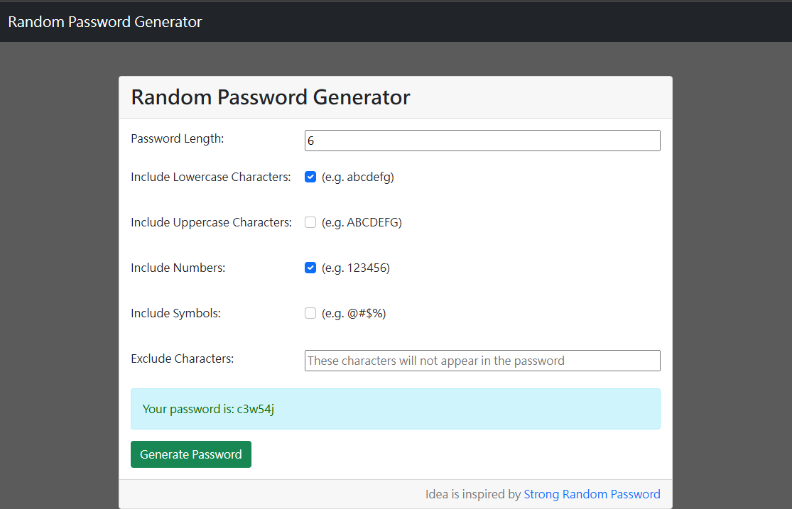

# 隨機密碼生產器

這是一個免費生產隨機密碼的工具

## 功能

- 能夠產生一組4~16個字元組成的密碼
- 多個字元提供作為密碼組成的選擇
- 提供輸入"不想包含在的內字元"的功能，能確保密碼生產時，不會出現該字元

## 執行環境

-Node.js v20.16

## 安裝

1. 開啟終端機

```
git clone https://github.com/goldsuraimu/password_generator.git
```

2. 移動到該資料夾

```
cd password_generator
```

3. 安裝相關套件

```
npm install
```

4.啟動程式

```
npm run start
```

啟動完成後，請至[http://localhost:3000](http://localhost:3000)

## 參考畫面


